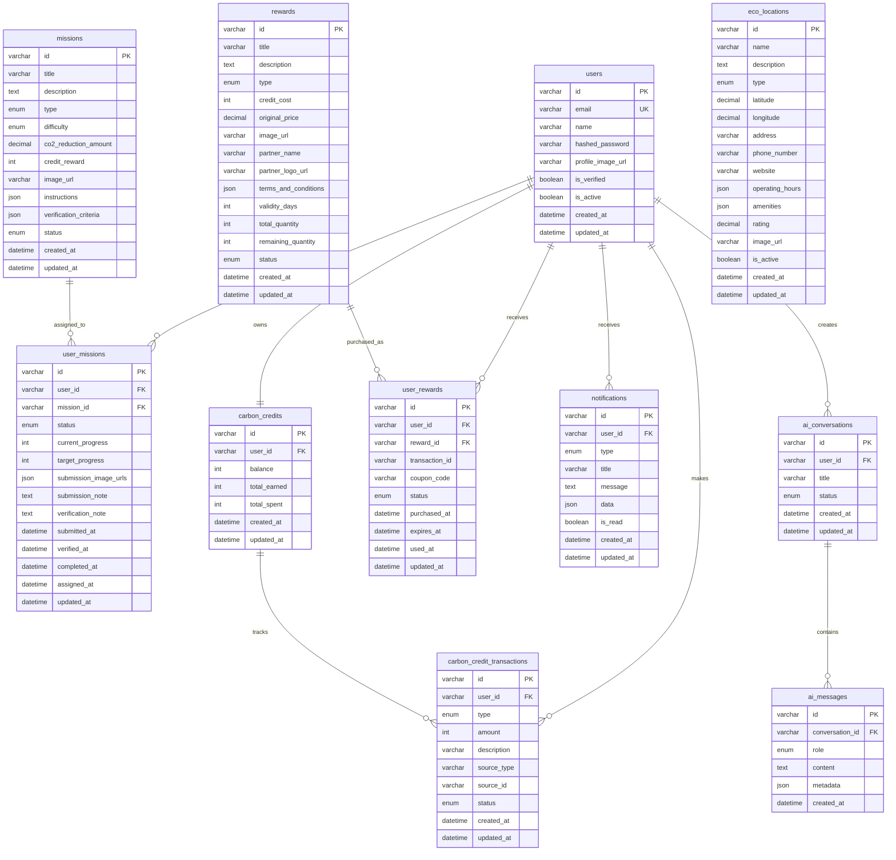

# EcoLife Server

🌱 Mission-based Carbon Credit Platform - Backend API Server

### 📁 Directory Structure

```
src/
├── domain/                     # 도메인 레이어 (비즈니스 로직)
│   ├── auth/
│   ├── user/
│   │   ├── entities/           # 도메인 엔티티
│   │   ├── value-objects/      # 값 객체
│   │   ├── repositories/       # 리포지토리 인터페이스
│   │   └── services/           # 도메인 서비스
│   ├── mission/
│   ├── carbon-credit/
│   ├── reward/
│   └── ...
├── application/                # 애플리케이션 레이어 (유스케이스)
│   ├── auth/
│   │   ├── use-cases/          # 비즈니스 유스케이스
│   │   └── dto/                # 데이터 전송 객체
│   ├── mission/
│   └── ...
├── infrastructure/             # 인프라스트럭처 레이어
│   ├── database/
│   │   ├── entities/           # TypeORM 엔티티
│   │   ├── repositories/       # 리포지토리 구현체
│   │   └── migrations/         # DB 마이그레이션
│   ├── external-apis/          # 외부 API 연동
│   └── file-storage/           # 파일 저장소
└── presentation/               # 프레젠테이션 레이어
    ├── auth/
    │   └── controllers/        # REST API 컨트롤러
    ├── mission/
    └── ...
```

### 🎯 Design Principles

- **단일 책임 원칙**: 각 클래스는 하나의 책임만 가집니다
- **의존성 역전**: 고수준 모듈이 저수준 모듈에 의존하지 않습니다
- **도메인 중심**: 비즈니스 로직이 기술적 세부사항과 분리됩니다
- **테스트 가능성**: 모든 레이어가 독립적으로 테스트 가능합니다

## 🗄️ Database Design

### ERD (Entity Relationship Diagram)



### 🔧 Database Features

- **정규화**: 모든 테이블이 3NF(제3정규형)를 만족합니다
- **인덱스 최적화**: 자주 조회되는 컬럼에 인덱스 적용
- **외래키 제약조건**: 데이터 무결성 보장
- **소프트 삭제**: 중요 데이터는 물리적 삭제 대신 상태 변경

## 🏗️ Project Philosophy

### Why This Architecture?

1. **확장성**: 새로운 기능 추가가 쉽습니다
2. **유지보수성**: 각 레이어가 독립적으로 변경 가능합니다
3. **테스트 용이성**: 의존성 주입으로 모든 컴포넌트가 테스트 가능합니다
4. **비즈니스 로직 보호**: 도메인 로직이 기술적 세부사항과 분리됩니다

### Code Quality Standards

- **SOLID 원칙** 준수
- **의존성 주입** 활용
- **타입 안정성** 보장
- **에러 핸들링** 표준화
- **로깅** 체계화

---

**Built with ❤️ by EcoLife Team**
